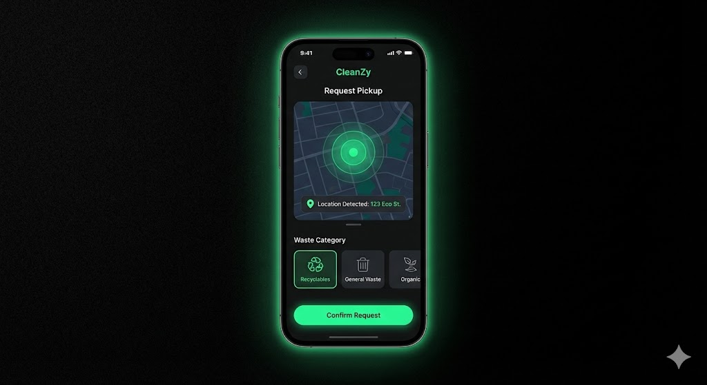

# ♻️ CleanZy – Smart Waste Management System

CleanZy is a full-stack **Smart Waste Management platform** built with the MERN stack. It enables citizens to report waste issues and schedule pickups while providing administrators with real-time control and actionable insights.

---

## 🚀 Features

### 🧑‍💻 Citizen Dashboard
- Secure login system
- Report issues with image upload
- Schedule waste pickups
- Track status of issues and pickups
- Eco points and CO₂ impact visualization
- Gamified user engagement

### 🛠️ Admin Panel
- Admin authentication
- View and approve pickup requests
- Manage issues reported by citizens
- Toggle system settings (maintenance, feature toggles)
- Robust role-based access

---

## 📸 Screenshots



---

## 🏗️ Technology Stack

| Frontend | Backend | Database | Deployment |
|----------|---------|----------|------------|
| React + Vite | Node.js + Express | MongoDB Atlas | Vercel / Render |

---

## 🧠 Architecture Overview

This project follows a **MERN stack architecture**:
- **Frontend**: React + Vite, dark theme UI, responsive design
- **Backend**: Express API with JWT authentication
- **Database**: MongoDB (collections for Users, Issues, Pickups, Settings)
- **Middleware**: Role-based access, maintenance mode enforcement

---

## 📦 Installation

### Clone the repo
```bash
git clone https://github.com/Chetan2324/CleanZy-Smart-Waste-Management.git
cd CleanZy-Smart-Waste-Management
```

### Set up environment variables
```bash
cp .env.example backend/.env
# Edit backend/.env with your actual values
```

### Install backend dependencies
```bash
cd backend
npm install
npm run dev
```

### Install frontend dependencies
```bash
cd frontend
npm install
npm run dev
```

---

## 👥 Team

| Name | Role | LinkedIn | GitHub |
|------|------|----------|--------|
| Chetan Sharma | Founder & CEO | [LinkedIn](https://www.linkedin.com/in/chetansharma3114) | [GitHub](https://github.com/Chetan2324) |
| Firoj Khan | Co-Founder & Operations | [LinkedIn](https://www.linkedin.com/in/firoj-khan786) | [GitHub](https://github.com/imfiroj123-gif) |
| Ankit Raj | Co-Founder & Tech Lead | [LinkedIn](https://www.linkedin.com/in/ankit-raj-006667218) | [GitHub](https://github.com/Ankit-CSE-01) |

---

## ⚠️ Disclaimer
This project uses **simulated data logic** for educational and demonstration purposes.
